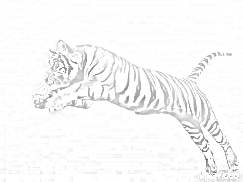
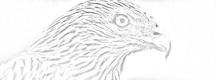
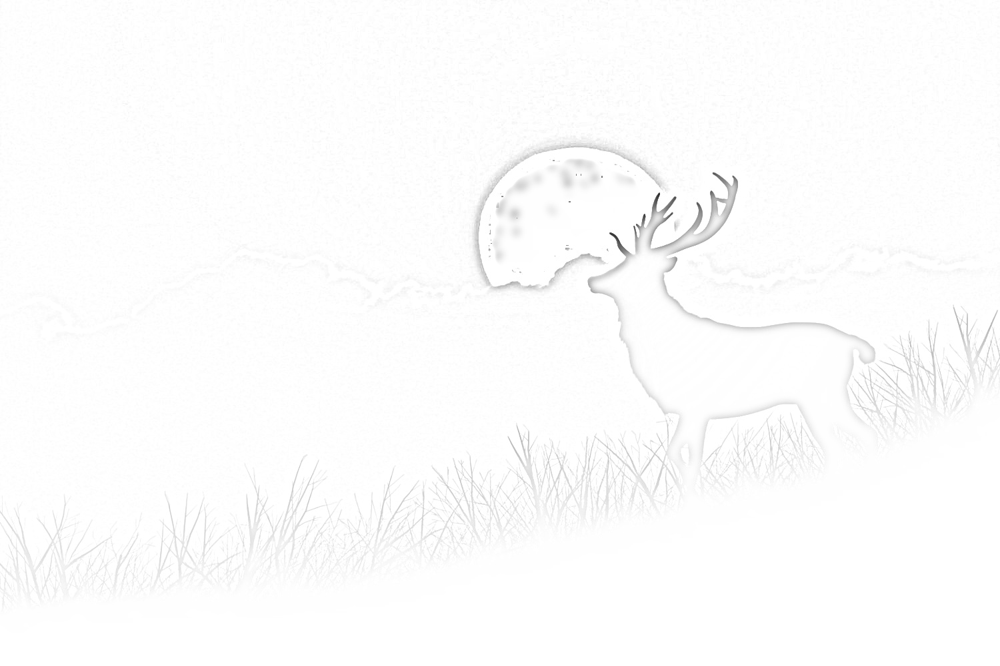
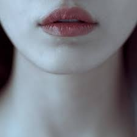
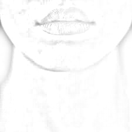
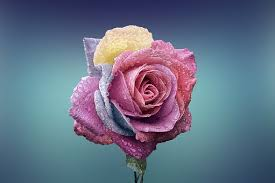
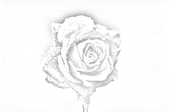

# Image-to-Sketch
Makes a sketch of any image

Just choose the file and it will make a sketch of the image with the same name with 'new' in it

Original (image.jpg):

Converted (image_new.jpg):

Original (tiger.jpg):

Converted (tiger_new.jpg):

Original (images.jpg):

Converted (images_new.jpg):

Original (deer.jpg):

Coverted (deer_new.jpg):

Original (face.jpg):

Converted (face_new.jpg):

Original (rose.jpg):

Converted (rose_new.jpg):

written by: Ali Zahid Raja

